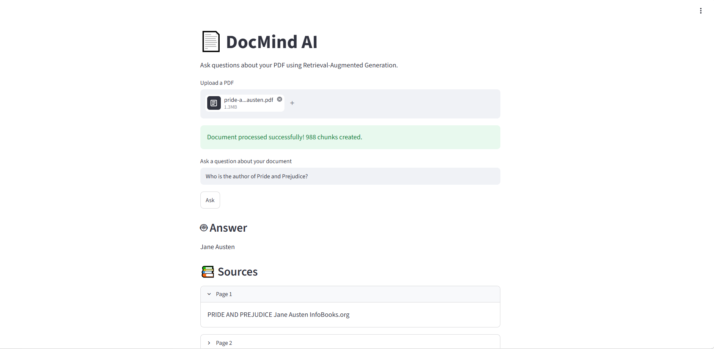

# 🚀 [Tips Hindawi](https://www.tipshindawi.com/) Challenge (June–July) 2026

> 🏆 This repository is my official submission for the [**Tips Hindawi**](https://www.tipshindawi.com/) **Challenge (June–July) 2026**.

## 👤 Participant

| Field                | Value                                            |
| -------------------- | ------------------------------------------------ |
| **Full Name**        | Ahmed Farag                                      |
| **Project Name**     | DocMind AI                                       |
| **GitHub Username**  | [@AhmedFarag22](https://github.com/AhmedFarag22) |
| **Challenge Batch**  | June–July 2026                                   |
| **Training Program** | Large Language Models (LLMs) Program             |
| **Organization**     | [**Edrak for AI**](https://edrak4ai.com/en)      |

---

# 📖 Project Overview

**DocMind AI** is an intelligent document question-answering system built using **Retrieval-Augmented Generation (RAG)**.

The system allows users to upload a PDF document and ask natural-language questions about its content. Instead of sending the entire document directly to the language model, DocMind AI retrieves the most relevant sections from the uploaded document and uses them as context to generate a focused answer.

The complete pipeline is:

```text
PDF Document
     ↓
Text Extraction
     ↓
Text Chunking
     ↓
Sentence Embeddings
     ↓
FAISS Vector Search
     ↓
Relevant Context Retrieval
     ↓
FLAN-T5
     ↓
Answer + Source Pages
```

This approach helps the system answer questions based on the actual content of the uploaded document.

---

# ✨ Features

* 📄 Upload PDF documents directly through the web interface.
* 🔍 Extract text from PDF pages using PyMuPDF.
* ✂️ Split long documents into smaller overlapping text chunks.
* 🧠 Generate semantic embeddings using Sentence Transformers.
* ⚡ Perform fast similarity search using FAISS.
* 🤖 Generate answers using Google's FLAN-T5 model.
* 📚 Retrieve relevant document sections before generating an answer.
* 📖 Display source pages used to answer the question.
* 🖥️ Simple and interactive Streamlit interface.
* 🔒 Designed to answer questions based on the uploaded document context.

---

# 🛠️ Technologies Used

* **Python**
* **Streamlit** — Web application interface
* **PyMuPDF** — PDF text extraction
* **LangChain Text Splitters** — Document chunking
* **Sentence Transformers** — Semantic embeddings
* **FAISS** — Vector similarity search
* **Hugging Face Transformers** — Model inference
* **FLAN-T5 Base** — Text-to-text generation model
* **NumPy** — Numerical operations
* **Git & GitHub** — Version control and project hosting

---

# 🧠 How the RAG Pipeline Works

## 1. Document Processing

The user uploads a PDF document through the Streamlit interface.

The system extracts text from each page while preserving the page number as metadata.

## 2. Text Chunking

Long document text is split into smaller overlapping chunks.

This improves retrieval quality and allows the system to work with long documents more effectively.

## 3. Embedding Generation

Each text chunk is converted into a numerical vector using:

```text
all-MiniLM-L6-v2
```

These vectors represent the semantic meaning of the text.

## 4. Vector Search

The generated embeddings are stored in a FAISS index.

When the user asks a question:

```text
Question
   ↓
Question Embedding
   ↓
FAISS Similarity Search
   ↓
Top Relevant Chunks
```

## 5. Answer Generation

The retrieved chunks are combined into a context and passed to:

```text
google/flan-t5-base
```

The model generates an answer based on the retrieved document context.

## 6. Source Display

The system also displays the page numbers of the retrieved document sections used during the answer-generation process.

---

# ⚙️ Installation

## 1. Clone the Repository

```bash
git clone https://github.com/AhmedFarag22/DocMind-AI.git
```

Navigate to the project directory:

```bash
cd DocMind-AI
```

---

## 2. Create a Virtual Environment

### Windows

```bash
python -m venv venv
```

Activate the environment:

```bash
venv\Scripts\activate
```

---

## 3. Install Dependencies

```bash
pip install -r requirements.txt
```

---

## 4. Run the Application

```bash
streamlit run app.py
```

The application will be available locally at:

```text
http://localhost:8501
```

---

# 🚀 Usage

1. Run the Streamlit application.
2. Upload a PDF document.
3. Wait for the document to be processed.
4. Enter a question related to the document.
5. Submit the question.
6. View the generated answer.
7. Review the relevant source pages.

Example:

```text
Question:
Who is Elizabeth Bennet?

Answer:
The system retrieves the relevant sections from the uploaded document and generates an answer based on the retrieved context.
```

---

# 📸 Demo

### Application Interface

Add screenshots of the application here:

```text
docs/
└── screenshots/
    ├── home.png
    ├── uploaded-document.png
    └── answer.png
```

Example:



https://github.com/user-attachments/assets/5ff714d3-e256-42ca-b743-116b552bf9ab


---

# 📈 Results

DocMind AI successfully demonstrates a complete end-to-end Retrieval-Augmented Generation pipeline:

* ✅ PDF document ingestion.
* ✅ Text extraction from uploaded documents.
* ✅ Semantic text chunking.
* ✅ Embedding generation.
* ✅ FAISS vector indexing.
* ✅ Similarity-based context retrieval.
* ✅ Question answering using FLAN-T5.
* ✅ Source page retrieval.
* ✅ Interactive Streamlit user interface.
* ✅ Local deployment and testing.

The project was successfully developed and tested locally after being initially prototyped and tested in a Kaggle environment.

---

# 🔮 Future Improvements

* 💬 Add conversational memory for multi-turn conversations.
* 📚 Support multiple PDF documents at the same time.
* 🗂️ Add document management and history.
* ⚡ Improve retrieval using hybrid search combining keyword and semantic search.
* 🎯 Add reranking models to improve retrieved context quality.
* 🧠 Experiment with larger and more powerful language models.
* 🌍 Add multilingual document question answering.
* ☁️ Deploy the application to a cloud platform.
* 🔐 Add user authentication and private document storage.
* 📊 Add document analytics and retrieval evaluation metrics.

---

# 📚 About the Challenge

This project was developed as part of the [**Tips Hindawi**](https://www.tipshindawi.com/) **Challenge (June–July 2026)**.

[Tips Hindawi](https://www.tipshindawi.com/) is the internships department of [**Edrak for AI**](https://edrak4ai.com/en), and the challenge encourages participants to build real-world projects, apply practical skills, and showcase their work through GitHub.

For more information about the challenge, training programs, and upcoming batches, visit the official [Tips Hindawi](https://www.tipshindawi.com/) website.

---

# 📄 License

This project is shared for educational and portfolio purposes.
