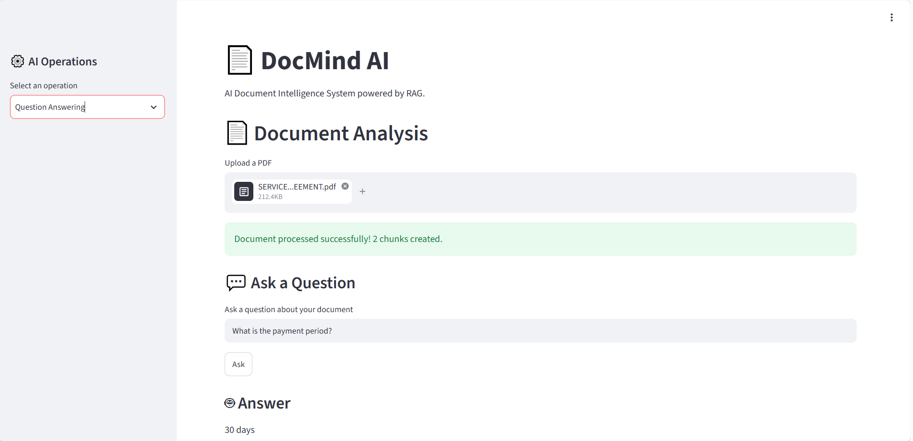

# 🚀 DocMind AI — AI Document Intelligence System

> 🏆 Official submission for the [**Tips Hindawi Challenge**](https://www.tipshindawi.com/) — June–July 2026.

## 👤 Participant

| Field                | Value                                       |
| -------------------- | ------------------------------------------- |
| **Full Name**        | Ahmed Farag                                 |
| **Project Name**     | AI Document Intelligence System                                  |
| **GitHub Username**  | AhmedFarag22                                |
| **Challenge Batch**  | June–July 2026                              |
| **Training Program** | Large Language Models (LLMs) Program        |
| **Organization**     | [**Edrak for AI**](https://edrak4ai.com/en) |

---

# 📖 Project Overview

**DocMind AI** is an AI-powered document intelligence system that allows users to upload PDF documents and interact with them using multiple intelligent analysis operations.

The system combines **Retrieval-Augmented Generation (RAG)**, semantic search, vector embeddings, and Large Language Models to understand and analyze document content.

Instead of manually searching through long documents, users can upload a PDF and perform tasks such as:

* Asking questions about the document.
* Generating concise summaries.
* Extracting important key points.
* Identifying potential risks.
* Comparing two documents and detecting important changes.

The goal of DocMind AI is to transform static PDF documents into interactive and intelligent sources of information.

---

# ✨ Features

## 💬 Question Answering

Ask questions about an uploaded PDF document.

The system:

1. Extracts the document text.
2. Splits the text into smaller chunks.
3. Converts the chunks into vector embeddings.
4. Retrieves the most relevant chunks using semantic similarity.
5. Uses an LLM to generate an answer based only on the retrieved context.

The generated answer includes:

* Answer
* Confidence level
* Source page references
* Relevant document excerpts

---

## 📝 Document Summarization

Generate a concise summary of a complete PDF document.

The system performs hierarchical summarization by:

* Summarizing individual document chunks.
* Combining the generated summaries.
* Creating a final concise summary containing the most important information.

---

## 🔑 Key Points Extraction

Automatically extract important structured information from documents.

The current implementation can identify important sections such as:

* Payment Terms
* Late Payment
* Contract Duration
* Termination
* Data Protection
* Governing Law

---

## ⚠️ Risk Analysis

Analyze documents for potential contractual risks.

The system can identify risks related to:

* Late Payment Penalties
* Confidentiality and Data Protection
* Contract Termination
* Financial Impact
* Extended Contractual Commitments

Each detected risk includes:

* Risk title
* Explanation
* Severity level

---

## 📊 Document Comparison

Compare two PDF documents and detect changes between them.

The comparison system identifies:

* Similar sections
* Different sections
* Added or removed sections
* Important numerical changes
* Potential risks caused by document modifications

It can detect changes such as:

* Payment period changes
* Late payment penalty changes
* Contract duration changes
* Termination notice changes

---

# 🧠 RAG Architecture

DocMind AI uses a Retrieval-Augmented Generation pipeline:

```text
        PDF Document
             │
             ▼
      Text Extraction
             │
             ▼
        Text Chunking
             │
             ▼
    Sentence Embeddings
             │
             ▼
       FAISS Vector Index
             │
             ▼
       Semantic Retrieval
             │
             ▼
     Relevant Document Context
             │
             ▼
           LLM
             │
             ▼
        AI-Generated Answer
```

For Question Answering, the system retrieves only the most relevant document chunks before sending the context to the language model.

This helps the model generate answers based on the uploaded document instead of relying only on general knowledge.

---

# 🛠️ Technologies Used

### Programming Language

* **Python**

### User Interface

* **Streamlit**

### Document Processing

* **PyMuPDF (fitz)**

### Text Splitting

* **LangChain Text Splitters**
* **RecursiveCharacterTextSplitter**

### Embeddings

* **Sentence Transformers**
* **all-MiniLM-L6-v2**

### Vector Search

* **FAISS**

### Large Language Model

* **Hugging Face Transformers**
* **FLAN-T5 Base**

### Data Processing

* **NumPy**
* **Regular Expressions**
* **JSON**

---

# ⚙️ Installation

## 1. Clone the Repository

```bash
git clone https://github.com/AhmedFarag22/DocMind-AI.git
```

```bash
cd DocMind-AI
```

---

## 2. Create a Virtual Environment

### Windows

```bash
python -m venv venv
```

Activate the virtual environment:

```bash
venv\Scripts\activate
```

---

## 3. Install Dependencies

```bash
pip install -r requirements.txt
```

---

## 4. Run the Application

```bash
streamlit run app.py
```

The application will open in your browser at:

```text
http://localhost:8501
```

---

# 🚀 Usage

## Single Document Analysis

1. Run the application.
2. Select an operation from the sidebar.
3. Upload a PDF document.
4. Select the desired operation:

   * Question Answering
   * Summarization
   * Key Points
   * Risk Analysis
5. View the generated results and document sources.

---

## Document Comparison

1. Select **Document Comparison** from the sidebar.
2. Upload **Document A**.
3. Upload **Document B**.
4. Click **Compare Documents**.
5. Review:

   * Similarities
   * Differences
   * Important Changes
   * Potential Risks

---

# 📸 Demo

## Application Interface



---

## 🎥 Demo Video

https://github.com/user-attachments/assets/dd072849-e446-4d2d-8db2-55312f18c9f7

> The demo video demonstrates the main features of the system, including PDF upload, document analysis, question answering, summarization, risk analysis, and document comparison.

---

# 📈 Results

DocMind AI successfully provides a unified AI-powered workflow for analyzing PDF documents.

The project demonstrates the practical application of:

* Retrieval-Augmented Generation (RAG)
* Semantic Search
* Vector Embeddings
* Large Language Models
* Natural Language Processing
* Document Intelligence

The system can transform unstructured PDF content into useful and actionable insights through multiple AI-powered operations.

---

# 🔮 Future Improvements

Future versions of DocMind AI may include:

* Support for additional document formats such as DOCX and TXT.
* Improved multilingual document support.
* OCR support for scanned documents.
* More advanced risk detection using LLM-based reasoning.
* Improved document comparison using semantic similarity.
* Persistent vector databases for large document collections.
* Conversation memory for multi-turn document conversations.
* Support for larger and more powerful language models.
* Exporting analysis results as PDF or DOCX reports.
* User authentication and document management.

---

# 📚 About the Challenge

This project was developed as part of the [**Tips Hindawi Challenge**](https://www.tipshindawi.com/) — June–July 2026.

The challenge provides participants with the opportunity to apply their technical knowledge to real-world projects and build practical solutions using modern technologies.

The project was developed as part of the **Large Language Models (LLMs) Program** at [**Edrak for AI**](https://edrak4ai.com/en).

For more information about the challenge, training programs, and upcoming opportunities, visit the official [**Tips Hindawi**](https://www.tipshindawi.com/) website.

---

# 📄 License

This project is developed for educational, training, and portfolio purposes as part of the Tips Hindawi Challenge.

© 2026 Ahmed Farag. All rights reserved.
